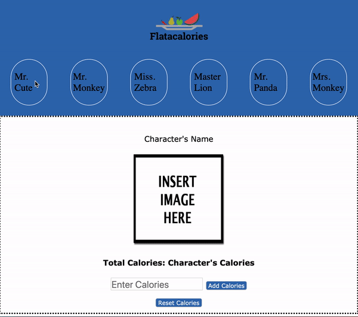

# Flatacalories
Today you'll be building an app for counting calories!! You will be using a local API and building out the frontend for our app, Flatacalories.

## Demo
Use this gif as an example of how the app should work.

## Setup
- Make sure you are cd into the code-challenge folder
- Run `json-server --watch db.json` to get the backend started
- Open the `index.html` file on your browser

## Endpoints

Your base URL for your API will be: http://localhost:3000

The endpoints you will need are:

- GET `/characters`
- GET `/characters/:id`
- PATCH `/characters/:id`

## Core Deliverables

As a user, I can:

1. See all characters names in a `div` with the id of `"character-bar"`. On page load, **request** data from the server to get all of the characters objects. When you have this information, you'll need to add a `span` tag with the character's name to the character bar.

2. Select a character from the character bar and see character's info inside `#detailed-info` div. 

3. Clicks on "Add Calories" button to add calories to a Character. Persist calories value to the server and update the DOM.

## Advanced Deliverables

These deliverables are not required to pass the code challenge, but if you have the extra time, or even after the code challenge, they are a great way to stretch your skills. Consider refactoring your current code before moving on.

> Note: If you are going to attempt these advanced deliverables, please be sure to have a working commit with all the Core Deliverables first!

As a user, I can:
- Clicks on a `Reset Calories` button to set calories to `0`. Persist calories value to the server and update the DOM.
- Change character's name
- Add a new character

## Rubric

You can find the rubric for this assessment [here](https://github.com/learn-co-curriculum/se-rubrics/blob/master/module-3.md).
